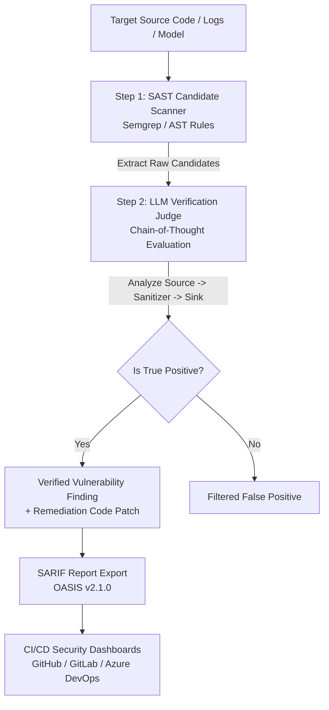

# Jailbreaker: Hybrid SAST, Security Log Audit & LLM Red-Teaming Suite

`Jailbreaker` is an enterprise-grade automated security auditing and evaluation framework. It combines:
1. **Hybrid SAST & LLM Verification**: Deterministic static application security testing (Semgrep/AST) paired with an LLM security judge to eliminate false positives and generate remediation patches.
2. **Software Composition Analysis (SCA)**: Scans dependency manifests (`requirements.txt`, `package.json`) against the OSV CVE database for vulnerable package versions.
3. **Interprocedural AST Taint Analysis**: Multi-file static analysis tracing untrusted user inputs across module function calls down to dangerous sinks.
4. **MITRE ATT&CK Threat Log Monitor**: Real-time correlation of system and application logs mapped to standard MITRE ATT&CK technique IDs (`T1059`, `T1110`, `T1078`, `T1190`, `T1552`).
5. **LLM Output & Tool-Calling Safety**: Audits model response text and function parameters for payload injection, command execution, and path traversal (OWASP LLM02 / LLM07 / LLM08).
6. **LLM Guardrail & Red-Teaming Evaluation**: Automated adversarial attack testing (prompt injection, role-play, hypothetical scenarios) to assess LLM safety boundaries.
7. **Natural Language Task Routing**: Plain-text objective execution via the `ObjectiveTaskRouter`.
8. **SARIF Enterprise Reporting**: Native export to OASIS SARIF v2.1.0 JSON format for GitHub Advanced Security, GitLab, and Azure DevOps integration.

---

## ⚡ Architecture & Workflow Preview



### 🖥️ Terminal Execution Preview

```text
$ python3 sast_scan.py --target ./src --model ollama

2026-08-15 10:05:32 - sast_scan - INFO - Starting Hybrid SAST scan on target: ./src
2026-08-15 10:05:32 - src.sast.pipeline - INFO - Step 1: Running SAST candidate scan on ./src...
2026-08-15 10:05:40 - src.sast.sast_runner - INFO - Candidate scan completed: Found 4 candidates.
2026-08-15 10:05:40 - src.sast.pipeline - INFO - Step 2: Verifying candidates using LLM security judge...
2026-08-15 10:05:42 - src.sast.pipeline - INFO - Confirmed True Positive: python.lang.security.audit.insecure-deserialization in src/app.py:L42
2026-08-15 10:05:42 - src.sast.pipeline - INFO - Filtered False Positive: python.lang.security.audit.dynamic-file-open in src/main.py
2026-08-15 10:05:42 - src.sast.pipeline - INFO - SARIF report exported to sast_report.sarif

=== Scan Summary ===
Target: ./src
Candidates Found: 4
Verified True Positives: 1
Report exported to: sast_report.sarif
```

---

## 📋 Table of Contents
- [Architecture & Workflow Preview](#-architecture--workflow-preview)
- [Installation](#-installation)
- [Configuration (`config.yaml`)](#-configuration-configyaml)
- [Usage & Commands](#-usage--commands)
  - [1. Dedicated SAST Scanner (`sast_scan.py`)](#1-dedicated-sast-scanner-sast_scanpy)
  - [2. Natural Language Objective Router (`run_objective.py`)](#2-natural-language-objective-router-run_objectivepy)
  - [3. LLM Red-Teaming & Safety Benchmarking (`src/main.py`)](#3-llm-red-teaming--safety-benchmarking-srcmainpy)
  - [4. Running Test APIs & Servicing (`live_chatbot_api.py` & `api.py`)](#4-running-test-apis--servicing-live_chatbot_apipy--apipy)
- [Project Directory Structure](#-project-directory-structure)
- [License & Legal Notice](#-license--legal-notice)

---

## 📦 Installation

### Prerequisites
- **Python 3.9+**
- **Semgrep** (Optional, recommended for full static ruleset support)
- **Ollama** (Optional, for local offline LLM verification)

### Step-by-Step Setup

1. **Clone the repository and enter the directory**:
   ```bash
   cd jailbreaker
   ```

2. **Install required Python dependencies**:
   ```bash
   pip install -r requirements.txt
   ```

3. **Install Semgrep (optional)**:
   ```bash
   pip install semgrep
   ```

---

## ⚙️ Configuration (`config.yaml`)

Edit `config.yaml` to specify API keys, model choices, and scanning options:

```yaml
models:
  openai:
    api_key: "sk-..."              # Your OpenAI API key
    model: "gpt-4o-mini"
    base_url: "https://api.openai.com/v1"
  
  ollama:
    api_key: ""
    model: "llama3.2:latest"        # Your local Ollama model (e.g. llama3.2:latest, deepseek-coder)
    base_url: "http://localhost:11434"
    timeout: 60
    temperature: 0.7
    max_tokens: 500

  groq:
    api_key: "gsk_..."
    model: "llama-3.1-8b-instant"

sast:
  semgrep:
    enabled: true
    config: "auto"                 # Or comma-separated configs: "p/python,p/security-audit"
  ast_fallback: true
  verifier:
    model: "openai"
    confidence_threshold: "MEDIUM"  # Options: HIGH, MEDIUM, LOW
  output:
    default_format: "sarif"
```

---

## 🚀 Usage & Commands

### 1. Dedicated SAST Scanner (`sast_scan.py`)

Runs the Hybrid SAST pipeline on a target source code directory or file, verifying candidate findings with an LLM judge.

#### Command Syntax:
```bash
python3 sast_scan.py --target <PATH> [OPTIONS]
```

#### Available Arguments:
| Argument | Short | Description | Default |
| :--- | :--- | :--- | :--- |
| `--target` | `-t` | **(Required)** Target file or directory path to scan. | *None* |
| `--output` | `-o` | Output report file path. | `sast_report.sarif` |
| `--format` | `-f` | Report format (`sarif` or `json`). | `sarif` |
| `--model` | `-m` | LLM verifier backend (`openai` or `ollama`). | `openai` |
| `--config` | `-c` | Configuration YAML file path. | `config.yaml` |
| `--stress-test` | | Enable data mutation & augmentation stress testing on candidates. | `False` |

#### Examples:

- **Basic scan on source code using OpenAI**:
  ```bash
  python3 sast_scan.py --target ./src
  ```

- **Run scan using local Ollama model (`llama3.2:latest`)**:
  ```bash
  python3 sast_scan.py --target ./src --model ollama
  ```

- **Scan with Stress Testing & JSON output**:
  ```bash
  python3 sast_scan.py --target ./src --format json --output findings.json --stress-test
  ```

---

### 2. Natural Language Objective Router (`run_objective.py`)

Interacts with the security suite using plain-text instructions. The `ObjectiveTaskRouter` maps your prompt to the relevant execution routines (SAST, log audit, red teaming, metrics).

#### Command Syntax:
```bash
python3 run_objective.py --objective "<INSTRUCTION>" [OPTIONS]
```

#### Available Arguments:
| Argument | Short | Description | Default |
| :--- | :--- | :--- | :--- |
| `--objective` | `-o` | **(Required)** Natural language instruction (e.g. `"run static scan"`). | *None* |
| `--target` | `-t` | Target file or folder path. | `.` |
| `--log-file` | `-l` | Path to log file for AI log auditing. | `sample.log` |
| `--target-url` | `-u` | Target chatbot API URL for live red-teaming. | `None` |
| `--model` | `-m` | Model provider (`openai`, `ollama`, `groq`). | `openai` |
| `--output` | | Save combined findings to a SARIF report file. | `None` |
| `--config` | `-c` | Configuration file path. | `config.yaml` |

#### Examples:

- **Run Static Analysis via plain text**:
  ```bash
  python3 run_objective.py --objective "run static scan" --target ./src
  ```

- **Audit Security Server Logs**:
  ```bash
  python3 run_objective.py --objective "audit logs" --log-file sample.log
  ```

- **Run Complete Audit (Code Scan + Log Audit + Metrics) with SARIF Export**:
  ```bash
  python3 run_objective.py --objective "run static scan, audit logs, and evaluate metrics" --target ./src --log-file sample.log --output results.sarif
  ```

- **Run Live DAST Chatbot Red-Teaming Attack**:
  ```bash
  python3 run_objective.py --objective "run red team attack" --target-url "http://localhost:8000/api/chat"
  ```

---

### 3. LLM Red-Teaming & Safety Benchmarking (`src/main.py`)

Runs direct adversarial attack evaluations (Prompt Injection, Role-Play, Hypothetical Scenarios) against configured models to evaluate guardrail robustness.

#### Command:
```bash
python3 -m src.main
```

Generates a detailed robustness score summary and outputs timestamped result YAMLs in `logs/`.

---

### 4. Running Test APIs & Servicing (`live_chatbot_api.py` & `api.py`)

- **Start Live Target Chatbot Endpoint** (for testing red-teaming & prompt injections):
  ```bash
  python3 live_chatbot_api.py
  ```
  *Starts API server at `http://localhost:8000/api/chat`*

- **Start REST API Server for SAST & Red-Teaming**:
  ```bash
  python3 api.py
  ```

---

### 5. Running Unit Tests

Run the full test suite:
```bash
python3 -m pytest
```

---

## 📁 Project Directory Structure

```
jailbreaker/
├── src/
│   ├── attacks/          # Prompt injection, role-play, and red-teaming engines
│   ├── evaluation/       # Security metrics and scoring logic
│   ├── models/           # OpenAI, Ollama, and Groq model wrappers
│   ├── sast/             # Semgrep/AST runner, LLM verifier, log analyzer, SARIF exporter
│   └── utils/            # Helper utilities and data augmentation mutators
├── tests/                # Pytest unit tests
├── rules/                # Custom static analysis security rules
├── config.yaml           # API keys & model configuration file
├── sast_scan.py          # Dedicated SAST scanner CLI entrypoint
├── run_objective.py      # Plain-text objective task router CLI entrypoint
├── live_chatbot_api.py   # Test chatbot endpoint server
├── api.py                # Framework REST API server
├── sample.log            # Sample log file for auditing tests
└── README.md             # Documentation
```

---

## ⚖️ Legal Notice

This tool is strictly intended for authorized security auditing, defensive research, and vulnerability remediation. Users are solely responsible for ensuring compliance with applicable laws, terms of service, and organizational policies. Do not execute security scans or red-teaming routines on systems or codebases without explicit written authorization.
