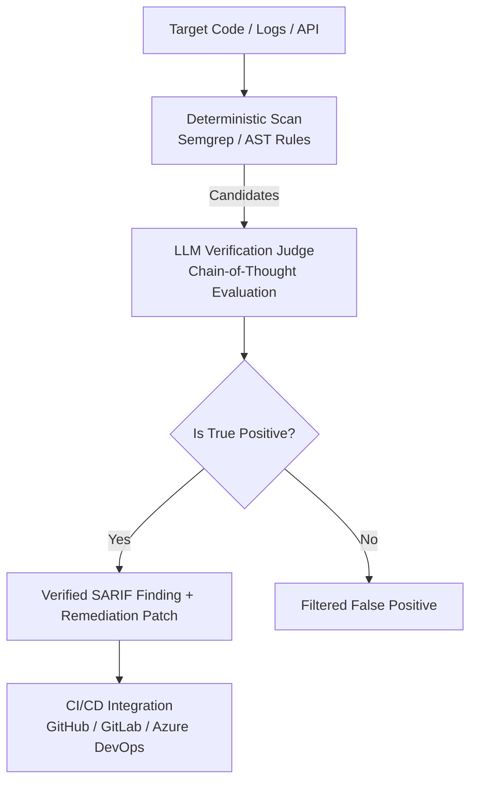

# Welcome to the Jailbreaker Wiki

`Jailbreaker` is an enterprise-grade automated security auditing and evaluation framework designed to evaluate source code, security logs, and AI model guardrails.

---

## Navigation Pages

1. **[Getting Started](Getting-Started)**
   - Prerequisites, installation steps, and environment configuration.

2. **[Hybrid SAST Pipeline](Hybrid-SAST-Pipeline)**
   - How static analysis (Semgrep/AST) integrates with Chain-of-Thought LLM verification to eliminate false positives and generate patches.

3. **[Software Composition Analysis (SCA)](Software-Composition-Analysis)**
   - Dependency manifest scanning against OSV CVE database.

4. **[Interprocedural Taint Analyzer](Interprocedural-Taint-Analyzer)**
   - Multi-file AST control flow and source-to-sink dataflow tracing.

5. **[MITRE ATT&CK Threat Log Monitor](MITRE-ATT&CK-Threat-Log-Monitor)**
   - Log stream correlation mapped to MITRE ATT&CK technique IDs.

6. **[LLM Red-Teaming & Guardrails](LLM-Red-Teaming-&-Guardrails)**
   - Automated adversarial testing (Prompt Injection, Role-Play, Hypothetical Scenarios) and DAST API evaluation.

7. **[Configuration Guide](Configuration-Guide)**
   - Complete reference for `config.yaml`, environment variables, model choices (OpenAI, Ollama, Groq), and SARIF reporting.

---

## Quick Architecture Overview

